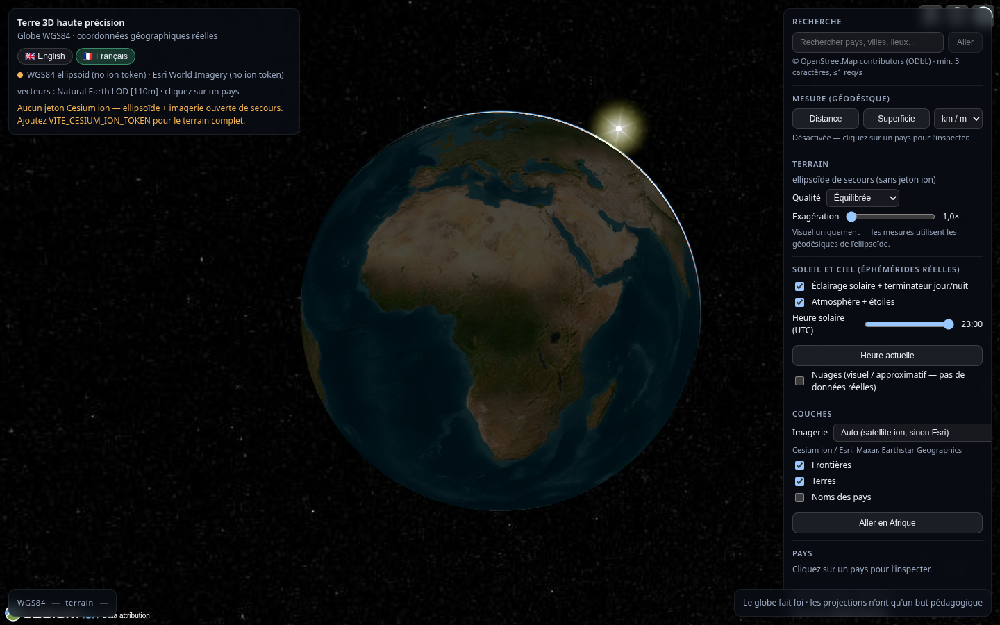
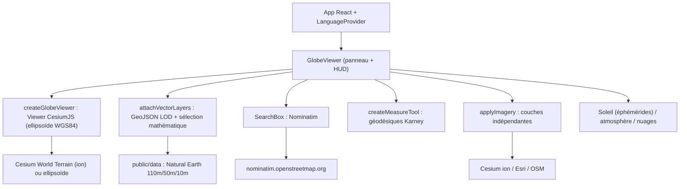

# Terre 3D haute précision

Visualisation géospatiale 3D interactive de la Terre, construite avec des coordonnées géographiques réelles — pas une carte plate plaquée sur une sphère.


[](https://cesium.com/platform/cesiumjs)
[](https://react.dev)
[](https://www.typescriptlang.org)
[](https://vite.dev)
[](https://vitest.dev)
[](https://www.khronos.org/webgl/)
[](https://geojson.org)



## Aperçu

Cette application affiche une **représentation 3D de la Terre** avec laquelle on interagit directement : rotation, zoom, inclinaison de la caméra, recherche de lieux, frontières des pays, relief, imagerie satellite et mesures géodésiques.

Elle existe pour une raison précise : une carte du monde rectangulaire classique ne peut pas représenter une sphère sans déformation (surface, forme, distances ou directions sont toujours compromises quelque part). Ici, les données géographiques restent exprimées en **longitude/latitude** et sont positionnées sur un **globe 3D**, qui est la représentation de référence. Aucune affirmation de type « 0 % de déformation » : seul le globe 3D évite les déformations propres au dépliage d'une sphère sur un plan.

## Précision géographique

- **Modèle terrestre : ellipsoïde WGS84** (`a = 6378137,0 m`, `f = 1/298,257223563`), fourni nativement par CesiumJS — jamais remplacé par une sphère mathématique arbitraire.
- **Système de coordonnées : WGS84 longitude/latitude en degrés décimaux** (GeoJSON, RFC 7946 / EPSG:4326). Les coordonnées transitent sans changement silencieux de CRS : `Cartographic` → ECEF sur l'ellipsoïde → plaquage sur le relief.
- **Données : frontières, continents et littoraux issus de jeux réels** (Natural Earth), chargés tels quels via `Cesium.GeoJsonDataSource`, plaqués au sol (`clampToGround`).
- **Relief : tuiles quantifiées** (*quantized-mesh*) diffusées en continu (Cesium World Terrain avec jeton, sinon ellipsoïde lisse de secours).
- **Imagerie : couche indépendante** du relief, des vecteurs et des étiquettes.
- **Calculs : géodésiques de Karney sur l'ellipsoïde** (bibliothèque GeographicLib) pour les distances et les surfaces — jamais de pixels d'écran ni de formule sphérique simplifiée.

## Afrique : le test de référence

L'Afrique n'est ni agrandie, ni réduite, ni étirée, ni « corrigée » : sa taille et sa forme émergent naturellement du placement mathématique de sa géométrie réelle sur l'ellipsoïde. Le panneau **« Vérification Afrique »** calcule la superficie du sous-ensemble africain avec la même méthode géodésique et la compare à la référence (~30 370 000 km², sources ONU/Banque mondiale) :

| Niveau de détail | Entités | Superficie mesurée | Écart | Verdict (tolérance ±5 %) |
| --- | --- | --- | --- | --- |
| 1:110m | 51 | 29 946 198 km² | −1,40 % | RÉUSSI |
| 1:50m | 54 | 29 890 202 km² | −1,58 % | RÉUSSI |
| 1:10m | 55 | 29 890 708 km² | −1,58 % | RÉUSSI |

L'écart résiduel (~−1,5 %) s'explique par la généralisation des littoraux et la définition du jeu de données (frontières *de facto*, fusion des micro-îles au 1:110m), pas par une manipulation. Madagascar, la corne de l'Afrique, le golfe de Guinée, la mer Rouge et la Méditerranée proviennent tous de la géométrie source.

## Fonctionnalités

**Globe 3D**
- Rotation (souris, tactile), zoom (molette, pavé tactile, pincement), inclinaison vers l'horizon, navigation orbitale, vol animé vers un lieu (`fly-to`), bouton d'accueil, sélecteur de vue 3D/2D/Columbus (la 3D fait foi).

**Recherche géographique (Nominatim / OpenStreetMap)**
- Pays, villes, lieux remarquables et coordonnées brutes (`lat, lon`), sans aucun lieu codé en dur. Résultats cliquables avec vol animé et marqueur. Détection de frappe avec limite de débit (≤1 req/s) et cache.

**Données géographiques**
- Frontières des pays, remplissage des terres et **noms des pays** (une étiquette par pays, ancrée sur sa plus grande masse terrestre — insensible aux îles lointaines), en trois niveaux de détail commutés selon l'altitude caméra.
- Clic sur un pays : surlignage, nom, continent, code ISO, population et superficie géodésique calculée — géométrie strictement préservée.

**Mesures**
- Distance (lignes multi-points) et superficie (polygones) par géodésiques WGS84, avec aperçu élastique, unités métriques ou impériales, et lecture directe des coordonnées WGS84 + altitude terrain sous le curseur.

**Visualisation**
- Relief réel avec modes de qualité, exagération verticale purement visuelle, 5 fonds d'imagerie commutables (dont un mode sans imagerie), éclairage solaire adossé aux éphémérides réelles avec heure UTC réglable, atmosphère et étoiles, couche nuageuse optionnelle explicitement **approximative**.

**Langues**
- Interface en **français** et en **anglais**, détection automatique du navigateur/système, sélecteur 🇬🇧/🇫🇷, choix mémorisé, nombres localisés (`Intl`) sans toucher aux calculs.

## Stack technique

| Technologie | Rôle | Site officiel |
| --- | --- | --- |
| [CesiumJS](https://cesium.com/platform/cesiumjs) | Globe 3D WGS84, relief, imagerie, caméra, atmosphère | [cesium.com](https://cesium.com) · [dépôt](https://github.com/CesiumGS/cesium) |
| [React](https://react.dev) | Interface utilisateur | [react.dev](https://react.dev) |
| [TypeScript](https://www.typescriptlang.org) | Typage statique | [typescriptlang.org](https://www.typescriptlang.org) |
| [Vite](https://vite.dev) | Construction et serveur de développement | [vite.dev](https://vite.dev) |
| [GeographicLib](https://geographiclib.sourceforge.io) | Géodésiques de Karney (`geographiclib-geodesic`) | [geographiclib.sourceforge.io](https://geographiclib.sourceforge.io) |
| [Vitest](https://vitest.dev) | Tests unitaires et géographiques | [vitest.dev](https://vitest.dev) |
| [WebGL](https://www.khronos.org/webgl/) | Rendu GPU (via CesiumJS) | [khronos.org](https://www.khronos.org/webgl/) |
| [GeoJSON](https://geojson.org) | Format des vecteurs (RFC 7946) | [geojson.org](https://geojson.org) |

Pas de *backend* ni base de données : application frontale statique déployable telle quelle.

## Architecture



La sélection d'un pays n'utilise pas le tampon de picking du rendu (fragile selon les pilotes) : longitude/latitude → point-dans-polygone sur le GeoJSON source. Les mesures partagent le même socle mathématique pur (`src/geodesy`), testé indépendamment du rendu.

## Structure du projet

```
src/
├── components/GlobeViewer.tsx  # globe + panneau latéral + HUD
├── config/env.ts               # jeton ion, vue initiale
├── geodesy/                    # wgs84, geodesic (Karney), areas, pick (maths pures)
├── globe/                      # createViewer, terrain, imagery, sun
├── i18n/                       # dict.ts (en/fr), lang.tsx (détection, persistance)
├── layers/vectors.ts           # couches LOD, étiquettes, sélection
├── measure/tool.ts             # outil interactif distance/surface
└── search/                     # nominatim.ts, SearchBox.tsx
public/data/                    # Natural Earth (110m/50m + sous-ensembles Afrique)
scripts/                        # fetch-natural-earth.mjs, qa-browser.mjs, qa-interactive.mjs
tests/                          # 13 fichiers de tests (72 tests)
docs/                           # ACCURACY, ARCHITECTURE, DATA_PROVENANCE, PERFORMANCE
```

## Installation

Prérequis : **Node.js 22** (testé avec v22.23.1) et `npm`.

```bash
git clone <url-du-depot>
cd <dossier-du-depot>
npm install
npm run fetch:data   # vecteurs Natural Earth → public/data (domaine public, ~20 Mo bruts)
cp .env.example .env # optionnel : ajouter VITE_CESIUM_ION_TOKEN (voir ci-dessous)
npm run dev          # http://localhost:5173/
```

| Commande | Usage |
| --- | --- |
| `npm run dev` | Serveur de développement |
| `npm run build` | Contrôle de types + build de production (`tsc -b && vite build`) |
| `npm run preview` | Prévisualisation du build |
| `npm test` / `npm run test:watch` | Suite de tests (72 tests) |
| `npm run typecheck` | Vérification TypeScript stricte (projets app + node) |
| `npm run lint` / `npm run format` / `npm run format:check` | `oxlint` / `prettier` |
| `npm run fetch:data` | Télécharge et valide les vecteurs Natural Earth |
| `npm run qa` | QA navigateur headless (rendu + assertions DOM + captures) |
| `npm run qa:interactive` | QA pilotée : recherche, mesure, couches, imagerie, langue |

## Variables d'environnement

| Variable | Obligatoire | Usage |
| --- | --- | --- |
| `VITE_CESIUM_ION_TOKEN` | Non | Relief Cesium World Terrain + imagerie ion. Sans jeton : ellipsoïde lisse + imagerie Esri ouverte (vecteurs inchangés). |
| `VITE_DEFAULT_VIEW_LON` | Non | Longitude initiale de la caméra (défaut : `20`). |
| `VITE_DEFAULT_VIEW_LAT` | Non | Latitude initiale (défaut : `5`). |

Copiez `.env.example` vers `.env` et renseignez vos valeurs. **Ne commitez jamais `.env`** (déjà couvert par `.gitignore`) : aucun secret ne doit figurer dans le dépôt.

## Sources de données

| Donnée | Utilisation | Source officielle | Licence |
| --- | --- | --- | --- |
| Pays, littoraux, terres | Frontières, remplissage, étiquettes, sélection | [Natural Earth](https://www.naturalearthdata.com) via [nvkelso/natural-earth-vector](https://github.com/nvkelso/natural-earth-vector) | Domaine public |
| Relief | Tuiles quantifiées mondiales | [Cesium World Terrain](https://cesium.com/platform/cesium-ion/content/cesium-world-terrain) (ion) | CGU Cesium ion (jeton, attribution) |
| Imagerie | Satellite (ion ou [Esri World Imagery](https://services.arcgisonline.com/ArcGIS/rest/services/World_Imagery/MapServer)), routes OSM | Cesium ion / Esri / [OpenStreetMap](https://www.openstreetmap.org/copyright) | CGU ion / Esri Master Agreement / ODbL |
| Recherche | Géocodage pays, villes, lieux | [Nominatim](https://nominatim.openstreetmap.org) (données OSM) | ODbL (attribution, ≤1 req/s, cache) |

Détail complet (versions, résolutions, traitement) : [`docs/DATA_PROVENANCE.md`](docs/DATA_PROVENANCE.md). Régénérez les vecteurs à tout moment avec `npm run fetch:data` (`public/data/manifest.json`).

## Licences et attribution

- **Code du projet : aucune licence choisie pour l'instant** (`package.json` sans champ `license`, aucun fichier `LICENSE`) — par défaut, tous droits réservés. **Choisir une licence avant toute publication.**
- Moteur et outillage : CesiumJS (Apache-2.0), React/ReactDOM (MIT), TypeScript (Apache-2.0), Vite (MIT), Vitest (MIT), GeographicLib (MIT/X11), Puppeteer (Apache-2.0), Prettier/oxlint/ESLint (MIT).
- Données : vecteurs Natural Earth dans le domaine public ; relief et imagerie ion soumis aux CGU Cesium ion ; imagerie Esri sous conditions Esri ; OSM/Nominatim sous ODbL avec attribution.
- **Attribution affichée dans l'application** (requis légal) : crédits Cesium ion automatiques, crédits Esri/OSM par couche, lien « Data attribution » de Cesium. La capture ci-dessus doit aussi les mentionner si elle est réutilisée avec des actifs ion.

## Tests et validation

72 tests (`npm test`), tous verts, dont :

| Fichier | Couverture |
| --- | --- |
| `wgs84.test.ts`, `coordinates.test.ts` | Constantes de l'ellipsoïde, ECEF, villes de référence, pôles, antiméridien, MultiPolygon |
| `africa-area.test.ts`, `africa-dataset.test.ts` | Verrou méthodologique + **vrais polygones Natural Earth contre 30 370 000 km² (±5 %, RÉUSSI aux 3 LOD)** |
| `measure.test.ts` | Somme des segments, bande Nairobi–Le Caire, unités métriques/impériales |
| `pick.test.ts`, `labels.test.ts` | Sélection point-dans-polygone (dont antiméridien), ancres États-Unis/France/Kenya, champ `NAME` |
| `search.test.ts`, `terrain.test.ts`, `imagery.test.ts`, `sun.test.ts`, `clouds.test.ts` | Parsing de coordonnées, MSSE, sources autorisées, horloge UTC, construction de couches |
| `i18n.test.ts` | Matrice de détection (fr/en/autres/malformés), priorité du choix manuel, replis, parité des dictionnaires, formatage FR |

QA navigateur headless (`npm run qa`, `npm run qa:interactive`, Chrome + SwiftShader) : rendu effectif (pixels allumés), badge LOD, verdict Afrique, raffinement 110m→50m au vol vers l'Afrique, 21 interactions (recherche, mesure, couches, imagerie, soleil, nuages, FR→rechargement→EN) sans aucune erreur console/page. Captures : `qa/screenshots/` (régénérables, ignorées par git).

## Performance

Stratégies réellement implémentées : LOD vectoriel (110m global → 50m sous 9 000 km → Afrique-10m sous 5 000 km survol Afrique), *streaming* de tuiles terrain/imagerie avec *frustum culling* et cache Cesium, modes de qualité (`maximumScreenSpaceError` 4/2/1 — densité de rendu uniquement, jamais la géométrie), anti-rebond caméra, recherche avec limite de débit et cache, fichier mondial 10m (12,7 Mo) exclu du déploiement. Ordres de grandeur mesurés : JS ~4,4 Mo (~1,2 Mo gzip, dominé par Cesium), vecteurs servis 7,5 Mo, suite de tests ~4 s. Méthodologie et chiffres : [`docs/PERFORMANCE.md`](docs/PERFORMANCE.md). **Pas de benchmark formel de fréquence d'images** — la QA logicielle cible SwiftShader, pas le GPU réel.

## Guide d'utilisation

- **Tourner** : glisser. **Zoomer** : molette, pavé tactile, pincement. **Incliner** : clic droit + glisser. **Voler** : recherche puis « Aller », ou « Aller en Afrique ».
- **Recherche** : ≥3 caractères, ou coordonnées directes (`9.0054, 38.7578`) ; Entrée = premier résultat, Échap = effacer.
- **Pays** : cliquer pour la fiche (nom, continent, ISO, population, superficie géodésique).
- **Mesure** : Distance ou Superficie → cliquer des points (aperçu en direct) → Effacer/Terminé, Échap annule. Unités km/m ou mi/ft.
- **Couches** : 5 fonds d'imagerie, frontières, terres, noms des pays.
- **Soleil et ciel** : éclairage, heure UTC (terminateur réel), atmosphère, nuages approximatifs.
- **Langue** : 🇬🇧/🇫🇷 en haut à gauche, mémorisé, appliqué sans recharger le globe.

## État et limites connues

Terminé : globe WGS84, vecteurs LOD + sélection mathématique, validation Afrique, relief, imagerie multicouche, recherche Nominatim, mesures géodésiques, qualité visuelle honnête, FR/EN avec détection, suite de tests + QA navigateur. Différé ou hors périmètre assumé : mode comparatif de projections 2D, proxy serveur pour Nominatim (recommandé en production), matrice d'essais sur appareils physiques, tuiles 3D additionnelles. Voir aussi [`docs/ACCURACY.md`](docs/ACCURACY.md) (bornes d'honnêteté, pas de précision fantasmée).

## Contribution

Dépôt en préparation de publication (aucun dépôt distant pour l'instant) : `npm install`, `npm test`, `npm run qa:interactive` avant toute proposition. Conventions : TypeScript strict, `prettier`, exactitude géographique avant esthétique, aucun secret commité, toute transformation de coordonnées documentée SOURCE → CIBLE.

## Licence du projet
MIT